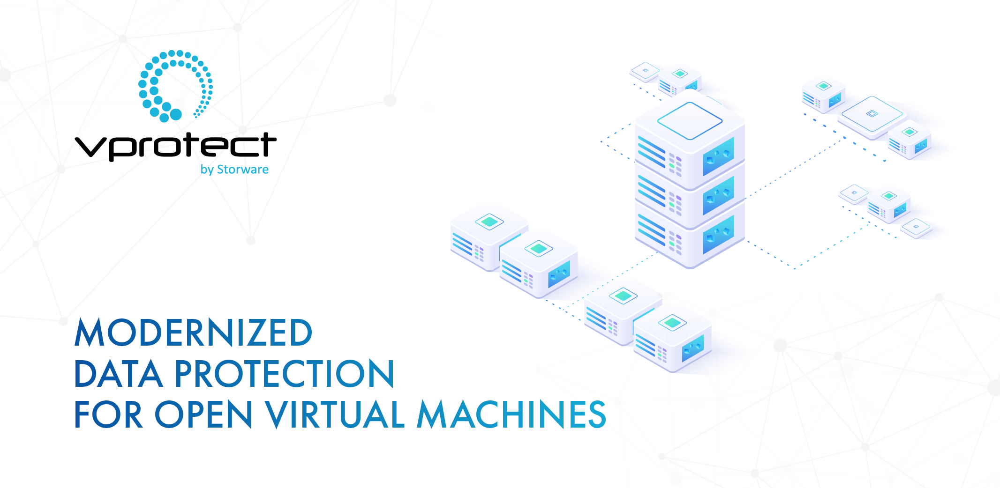

# Introduction

##   

## Storware vProtect 3.9 Update 1 Documentation

This is the official documentation for Storware vProtect software. Here you'll find all the information needed to setup and configure backup for your virtual infrastructure.

### About vProtect

Storware vProtect is a backup and snapshot-management tool for VMs/containers running in open virtual environments and any application which allows to automate backup process with scripts. With easy management interface, you are able to quickly set up protection and store backups in several different backup providers.

#### Functional details:

* VM-level backup and protection
* Support for VMware vSphere, Microsoft Hyper-V, libvirt hypervisors \(KVM, PowerKVM, KVM for IBM z, Xen\),
Citrix XenServer/XCP-ng, Proxmox VE, RHV/oVirt/OLVM, Oracle VM and AWS EC2 environments
* Snapshot management \(Copy Data Management\) for VMware vSphere, Microsoft Hyper-V, Citrix XenServer, Proxmox VE, RHV/oVirt, Nutanix AHV and Amazon EC2
* Generic application backup with your custom scripts with ready templates for commonly used databases
* Deployment protection \(PVs and deployment metadata\) for Kubernetes and OpenShift environments
* Hybrid Protection \(2nd Tier can be at enterprise backup server or in the cloud\)
* Multi-node support for better scalability or geographically dispersed environments
* Disaster Recovery based on IBM Spectrum Protect \(TSM\), Dell-EMC Networker, Dell-EMC Avamar, Veritas Netbackup, Amazon S3 \(with Amazon Glacier as a 2nd tier archive storage\), S3-compliant storage, Google Cloud Storage, Microsoft Azure, OpenStack Swift or any mounted file-system \(local or remote, especially GlusterFS for replication, CephFS, NFS, SMB and many more\)
* Recovery plan for automated DR - on-demand restore of multiple VMs when needed, or on a scheduled basis for testing
* Open API for 3rd party software integration \(REST API\)
* Incremental backups \(with native CBT, where available\) for VMware vSphere, Hyper-V, Citrix XenServer, oVirt/RHV/OLVM and Nutanix AHV 5.5+ hypervisors and stand-alone KVM
* Option to backup only selected VM disks
* Build in data deduplication with VDO
* OpenStack and KVM stand-alone with Ceph storage support
* Data encryption for Amazon S3/Google Cloud Storage/Microsoft Azure/file system backup providers
* Prioritized backup
* Last backup can be kept on vProtect Server for faster recovery
* File-level restore using mountable backups \(KVM, Xen, Citrix XenServer/XCP-ng, Proxmox VE, RHV/oVirt/OLVM, Nutanix AHV, Oracle VM, AWS EC2\) directly from Web UI
* Mounted backups' RAW disks shareable over iSCSI \(for direct block-access to your backup data\)
* RHV/oVirt API v4 support with proxy VM backup strategy \(which doesn't require export storage domain\) and Disk Image Transfer API for incremental backups
* VM auto-grouping based on regular expressions and tags \(Citrix XenServer, RHV/oVirt, Oracle VM, AWS EC2\)
* Data is exported in native \(hypervisor-specific\) format
* Snapshot consistent technology \(and use of quiesced snapshots for Citrix XenServer, Nutanix AHV and FS freeze in oVirt/RHV environments\)
* Pre/post snapshot remote command execution on VM to enable operations such as DB quiesce
* Pre/post backup destination access command execution to allow mount/unmount operations on external storage providers
* LDAP authentication in management console
* Build-in vProtect DB backup
* Automatic reporting and log upload to Storware Insight for improved technical support
* Easy to use and intuitive management \(HTML5 web UI and CLI\) - protect your virtual infrastructure in 3 easy steps:
  1. Connect to your infrastructure and backup provider
  2. Schedule backups or backup on demand
  3. Restore/mount VM backup if needed \(or just use local copy of last backup\)
     * To local vProtect storage
     * To any remote location mountable on vProtect Server
     * Directly to the virtualization environment
     * Directly to the VM with volumes shared over iSCSI

### Contact

WWW: [http://www.storware.eu](http://www.storware.eu)

Support: [https://storware.atlassian.net/servicedesk/customer/portal/10](https://storware.atlassian.net/servicedesk/customer/portal/10)

E-mail: [info@storware.eu](mailto:info@storware.eu)

