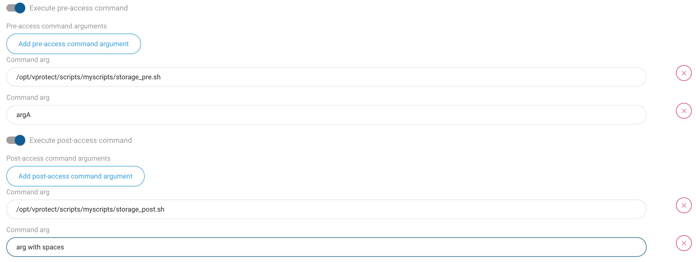

# How to setup pre/post BD access command execution

1. Prepare your scripts
   * pre script is being invoked before every access to the Backup Destination - common usage - create and mount remote volume
   * post script is executed after Node finishes store, restore, clean up operations
2. The following enviornmental variables are being set before each execution - you can use them later in your scripts:
   * `VP_VM_GUID` - GUID of the VM in vProtect
   * `VP_VM_UUID` - UUID of the VM used by hypervisor or hypervisor manager
   * `VP_VM_NAME` - name of the VM
   * `VP_VM_TMP_DIR` - path to the folder containing files on staging
   * `VP_BD_GUID` - GUID of the Backup Destination being accessed
   * `VP_BD_NAME` - name of the Backup Destination being accessed
   * `VP_CONTAINER_NAME` - standard container name generated by the vProtect that can be used for names of the volumes \(format `<VM-NAME>__<PART-OF-UUID>`, i.e. `Centos 7__8d3ef6f1`, may contain special characters
   * `VP_EXPORT_PATH` - export path from Node Configuration, can be used as the mount root for backup destination volumes
   * `VP_TASK_TYPE` - name of the task type, e.g.: `STORE`/`RESTORE`/`DELETE_VM`/`OLD_BACKUPS_REMOVAL` - to distinguish operation type when scripts are being invoked
3. Upload your scripts to the **node**, where `vprotect` user is able to access them
4. Optionally, you may need to add a new file in `/etc/sudoers.d/` directory to enable `vprotect` user execute privileged script \(like chown operations in some file system locaitons\):

   ```text
   %vprotect ALL=(root) NOPASSWD: /opt/vprotect/scripts/myscripts/privileged.sh
   ```

5. Open "BACKUP DESTINATIONS" section from the left menu:


1. Open your Backup Destination \(click on its name\)
2. Provide pre/post access command arguments \(first argument is the command being executed locally on the **node**\):



1. Initiate backup to test it the scripts have been executed correctly - in the `vprotect_daemon.log` files you should be able to see messages like this:

   ```text
   2018-05-04 15:31:39.133  INFO
   [0f2b9705-61a1-44d5-876f-ac81985c4a94] Executing pre/post store command...
   ```

