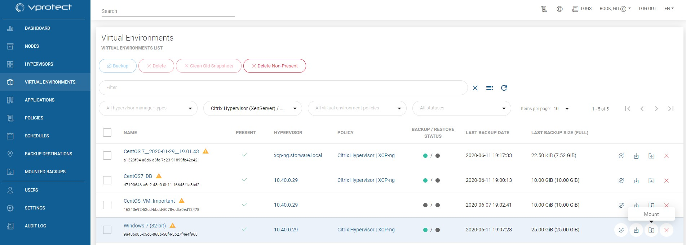
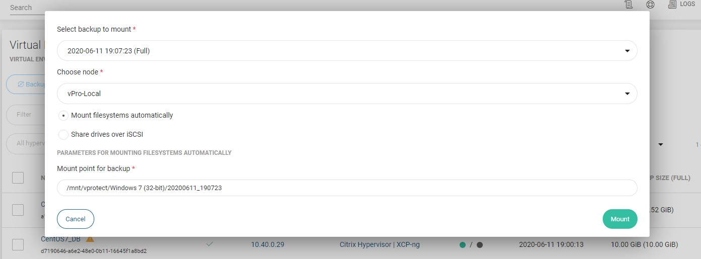
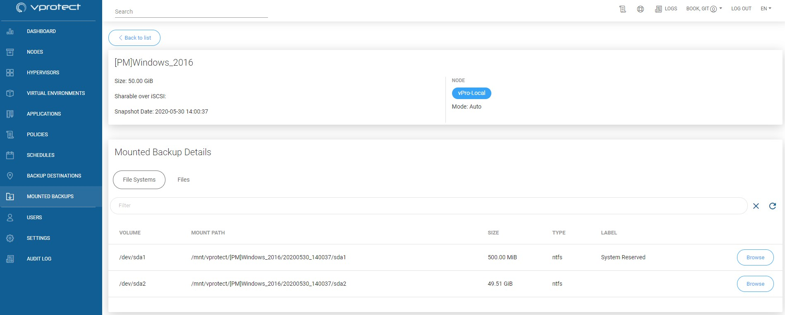

# File-level Restore \(Mounted Backup\)

**Note:** To see which hypervisor support this feature please go to [vProtect Support Matrix](../planning/vprotect-support-matrix.md).

To mount backup go to the virtual environment on the left side menu, then click on mount icon next to a chosen virtual machine 

On popup window you can select which backup you want to mount and on which node. You can also change the mount method, but we recommend leaving the default setting "Mount filesystem automatically".
If you choose to mount BTRFS filesystem automatically vProtect will mount last available snapshot.

Mounted Backups tab show mounted Virtual Machine backup's on vProtect node.

* `VIRTUAL MACHINE` - mounted virtual machine name
* `MODE` - Auto - vProtect auto detect filesystems and mount it on path "/mnt/vprotect/". In Manual mode user chose mount point for selected filesystems.
* `NODE` - vProtect node responsible for mount job.
* `SNAPSHOT DATE` - date of mounted backup of the VM.
* `FILE SYSTEMS` - number of mounted filesystems.
* `FILES` - number of mounted virtual disk images.

Next to every mounted backup you can see three buttons:  
To unmount backup click on   
To remount backup click on   
To go to the details page of mounted backup click on 

At details page, you can view some basic information or go deeper and browse files.

With a web browser you can obtain even a single file from inside of your backup VM.

## You can also perform the same action thanks to the CLI interface: [CLI Reference](cli-reference.md#mounted-backups)

