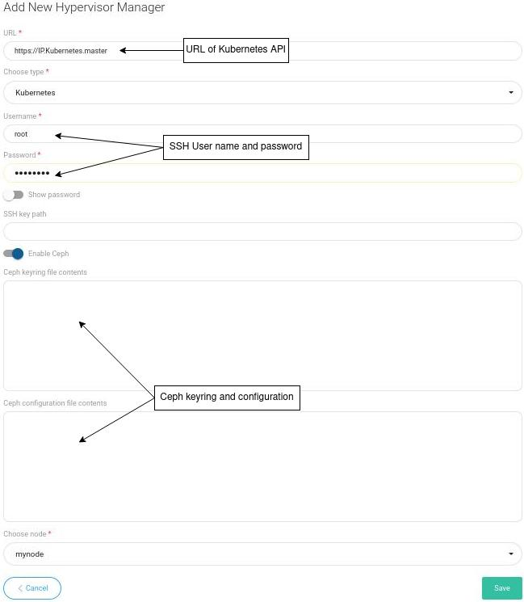

# Kubernetes

## vProtect Node preparation

vProtect Node requires `kubectl` installed \(you have to add kubernetes repository to install `kubectl`\) and `kubeconfig` with a valid certificates \(placed in `/home/user/.kube`\) to connect to the Kubernetes cluster.

1. Check if your kubeconfig looks the same as below.

Example:

```yaml
   current-context: admin-cluster.local
   kind: Config
   preferences: {}
   users:
   - name: admin-cluster.local
     user:
       client-certificate-data: <REDACTED>
       client-key-data: <REDACTED>
```

1. Copy configs to vProtect Node. \(**Skip this and point 2 if you don't use Minikube**\)
   * If you use Minikube, you can copy the following files to vProtect: `sudo cp /home/user/.kube/config /opt/vprotect/.kube/config sudo cp  /home/user/.minikube/{ca.crt,client.crt,client.key} /opt/vprotect/.kube`
2. Modify the paths in `config` so they point to `/opt/vprotect/.kube` instead of `/home/user/.minikube`. Example:

```yaml
- name: minikube
  user:
    client-certificate: /opt/vprotect/.kube/client.crt
    client-key: /opt/vprotect/.kube/client.key
```

3. Afterwards, give permissions to the `vprotect` user: `chown -R vprotect:vprotect /opt/vprotect/.kube`



Kubernetes Nodes should appear in vProtect after indexing the cluster.

**Notice 1**: Please provide the URL to the web console and SSH credentials to master node when creating the OpenShift hypervisor manager in vProtect UI. You can also use [SSH public key authentication](../../common-tasks/ssh-public-key-authentication.md). This is needed for vProtect to have access to your cluster deployments. **Notice 2:** Valid SSH admin credentials should be provided **for every Kubernetes node** by the user \(called _Hypervisor_ in the vProtect UI\). if vProtect is unable to execute docker commands on Kubernetes node, it means that it logged as an user lacking admin privileges. Make sure you added your user to sudo/wheel group \( so it can execute commands with `sudo`\). **Notice 3:** If you want to use Ceph you must provide ceph keyring and configuration. Ceph requires ceph-common and rbd-nbd packages installed.

**Persistent volumes restore/backup**

There are two ways of restoring the volume content.

1. The user should deploy an automatic provisioner which will create persistent volumes dynamically. If Helm is installed, the setup is quick and easy [https://github.com/helm/charts/tree/master/stable/nfs-server-provisioner](https://github.com/helm/charts/tree/master/stable/nfs-server-provisioner).
2. The user should manually create a pool of volumes. vProtect will pick one of the available volumes with proper storage class to restore the content.

**Limitations**

* currently we support only backups of Deployments/DeploymentConfigs \(persistent volumes and metadata\)
* **all deployment's pods will be paused during the backup operation** - this is required to achieve consistent backup data
* for a successful backup, every object used by the Deployment/DeploymentConfig should have an `app` label assigned appropriately

