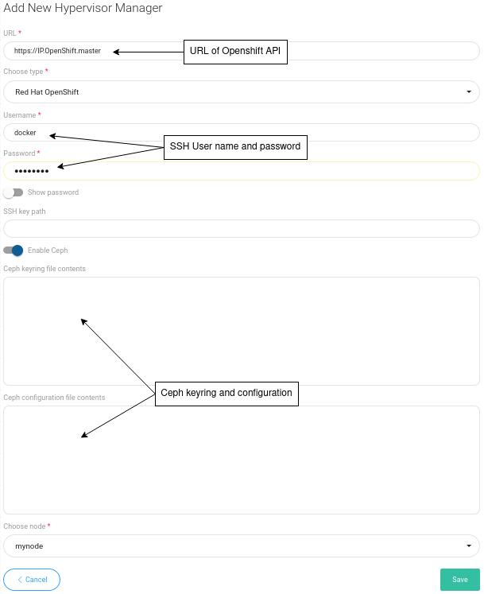

# Red Hat OpenShift

Login to Web UI and add new Hypervisor Manager of type OpenShift:

## vProtect Node preparation

Openshift Nodes should appear in vProtect after indexing the cluster.

**Notice 1**: Please provide the URL to the web console and SSH credentials to master node when creating the OpenShift hypervisor manager in vProtect UI. You can also use [SSH public key authentication](../../common-tasks/ssh-public-key-authentication.md). This is needed for vProtect to have access to your cluster deployments. **Notice 2:** Valid SSH admin credentials should be provided **for every Openshift node** by the user \(called _Hypervisor_ in the vProtect UI\). if vProtect is unable to execute docker commands on Openshift node, it means that it logged as an user lacking admin privileges. Make sure you added your user to sudo/wheel group \( so it can execute commands with `sudo`\).

**Persistent volumes restore/backup**

There are two ways of restoring the volume content.

1. The user should deploy an automatic provisioner which will create persistent volumes dynamically. If Helm is installed, the setup is quick and easy [https://github.com/helm/charts/tree/master/stable/nfs-server-provisioner](https://github.com/helm/charts/tree/master/stable/nfs-server-provisioner).
2. The user should manually create a pool of volumes. vProtect will pick one of the available volumes to restore the content.

**OpenShift troubleshooting**

User from the current context should have cluster-admin permissions.

`oc adm policy add-cluster-role-to-user cluster-admin admin --as system:admin`

In this case, you should stay logged in as `admin` for the connection to be successful.

The following error might occur if the token in the kubeconfig file is invalid:

`Failure executing: GET at: [https://192.168.42.206:8443/api/v1/persistentvolumes](https://192.168.42.206:8443/api/v1/persistentvolumes "Follow link"). Message: Unauthorized! Token may have expired! Please log-in again. Unauthorized.`

Solution:

On OpenShift master node, execute `oc login -u admin` \(or any other user with cluster-admin permissions\) and index the OpenShift hypervisor manager in vProtect UI again.

If indexing/export fails because no Pods could be found, please make sure they have the `app` label assigned appropriately.

**Limitations**

* currently we support only backups of Deployments/DeploymentConfigs \(persistent volumes and metadata\)
* **all deployment's pods will be paused during the backup operation** - this is required to achieve consistent backup data
* for a successful backup, every object used by the Deployment/DeploymentConfig should have an `app` label assigned appropriately

