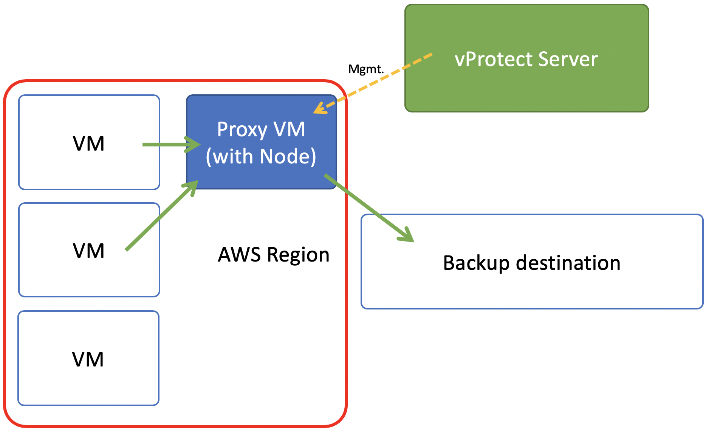
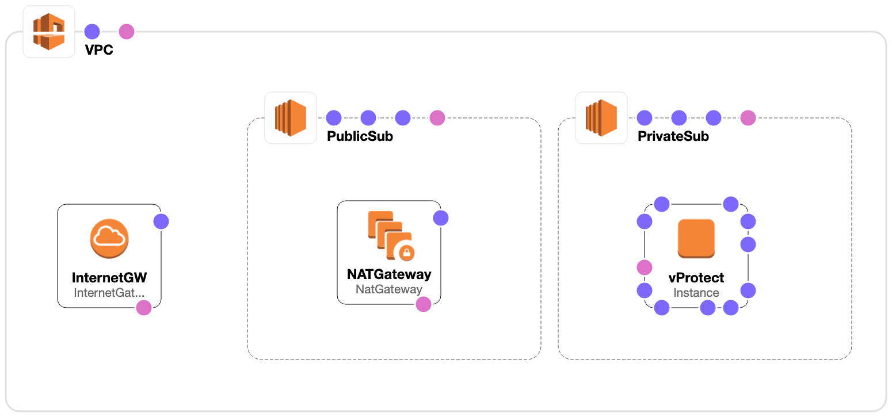

# Deployment in AWS EC2 environment

vProtect supports AWS EC2 cloud platform by using a VM called “Proxy VM”. Node invokes commands on AWS to snapshot and attach EBS drives of a specific VM to itself \(Proxy VM\). Proxy VM is able to read the data from the attached disk snapshots and forward them to backup provider.

This means that you need to create an EC2 instance \(Proxy VM\) in each region. Keep in mind that if you don't want to transfer data between AZ during the backup you may want to deploy Proxy VMs in each AZ.

vProtect Server can be deployed anywhere, but keep in mind that Nodes need to be able to call server over HTTP\(S\) on the port you have specified.

Backup strategy for AWS allows you to exclude drives from backup which you don’t need. Remember that, you need to install 1 Proxy VM per AWS region, so that drives that Node tries to attach are reachable.

All backup destinations can be used but keep in mind that you may be charged for transferring data between regions, AZs and to external backup providers.



## Typical use cases

There are several scenarios for AWS which may suit your case:

* **Backup EC2 to S3** - in this case after dumping backup vProtect can push them to S3 bucket. You may consider using VPC endpoint to boost your store operation performance
* **Backup EC2 to EBS volume on the proxy** - you then can use VDO to deduplicate data and optimize your storage consumption significantly. Keep in mind that you may want to protect your EBS volume using EBS snapshots as well.
* **Backup EC2 to your local backup provider** - if you have already central enterprise backup solution you may want to use it for as a backup provider for EC2 instances running in AWS. You should consider using Direct connect to have higher bandwidth available.
* **Backup EC2 to your other cloud provider** - If you're using multiple clouds you also may consider storing data in GCS or Azure backup providers.

**Notice**: In all cases depending on your target - you may be charged for data transfers.

## Setup considerations

It is assumed that you have a working experience with AWS EC2 to be able to deploy vProtect components. You also need to have IAM user with permissions that allow you to deploy instance and generate access/secret keys for vProtect.

Remember to use **CentOS 7 AMI** as a base image - both for Server and Nodes. We recommend to have 2 vCPU and 4GB of RAM for typical installation. This means that **t3.medium** or **m5.large** should cover general use cases. For better performance we recommend however to use storage optimized instances such as **i3.large** or bigger, where I/O intensive operations should perform better.

Both vProtect components are assumed to be deployed without HA \(more precisely, all nodes or server probably will be in separate AZs, and just need to communicate over HTTP\). There is no requirement for multi-AZ deployment for now. While the Node is stateless, and can be lost without data loss, Server needs DB to be protected. vProtect provides build-in automatic DB backup mechanism, which can be used to protect backup metadata. Please refer to: [Disaster recovery](../admin_dr.md) section for more details.

From the networking perspective, vProtect requires to communicate with AWS EC2 API, but still it is recommended to put in a private subnet and allow communication over NAT Gateway.



You add AWS EC2 as Hypervisor Manager. You need to provide account ID and access/secret keys of a user that has permissions to handle snapshot, AMI and EBS volume operations, EC2 instance creation.

In the same screen you also specify if AMIs of root volumes should be created during backup process. For Windows instances we recommend to keep also AMI image with each backup to have option to restore original root volume as well. You also can skip AMI creation, but this means that during restore you need to specify appropriate AMI ID that you want to boot from.

## Permissions

Here are IAM permissions that vProtect needs to have for backup/restore operations

```text
{
  "Version": "2012-10-17",
  "Statement": [
    {
      "Sid": "Stmt1565003475859",
      "Action": [
        "ec2:AttachNetworkInterface",
        "ec2:AttachVolume",
        "ec2:CreateImage",
        "ec2:CreateSecurityGroup",
        "ec2:CreateSnapshot",
        "ec2:CreateTags",
        "ec2:CreateVolume",
        "ec2:DeleteSnapshot",
        "ec2:DeleteVolume",
        "ec2:DeregisterImage",
        "ec2:DescribeAvailabilityZones",
        "ec2:DescribeImages",
        "ec2:DescribeInstances",
        "ec2:DescribeSecurityGroups",
        "ec2:DescribeSnapshots",
        "ec2:DescribeVolumes",
        "ec2:DetachVolume",
        "ec2:RegisterImage",
        "ec2:RunInstances",
        "ec2:StopInstances",
        "ec2:TerminateInstances"
      ],
      "Effect": "Allow",
      "Resource": [
        "arn:aws:ec2:*:*:instance/*",
        "arn:aws:ec2:*:*:volume/*",
        "arn:aws:ec2:*:*:snapshot/*",
        "arn:aws:ec2:*:*:image/*",
        "arn:aws:ec2:*:*:network-interface/*",
        "arn:aws:ec2:*:*:security-group/*"
      ]
    }
  ]
}
```

## Costs

From AWS perspective you need to to take several additional costs that may be incurred:

* EC2 instance costs for vProtect Server and Nodes:
  * depends on number of nodes \(assume at least one node per region\)
  * to reduce costs we recommend to use reserved instances for production use
  * [https://aws.amazon.com/ec2/pricing/](https://aws.amazon.com/ec2/pricing/)
* Backup destination and staging space storage on EBS
  * staging space is necessary and we recommend it to be at least the size of the biggest VM multiplied by number of export and store threads
  * if you want to store backups on EBS you also need to have additional storage
  * you can have both using the same EBS volume
  * we encourage you to use deduplication, as it may result even over 95% of storage savings
  * [https://aws.amazon.com/ebs/pricing/](https://aws.amazon.com/ebs/pricing/)
* Data transfer costs:
  * if you upload data to external backup providers
  * or if node needs to transfer a lot of data between AZs - this can be reduced by deploying one node per AZ
  * [https://aws.amazon.com/ec2/pricing/on-demand/\#Data\_Transfer](https://aws.amazon.com/ec2/pricing/on-demand/#Data_Transfer)
* S3 backup destination:
  * if used - check [AWS S3 or S3-compatible](../initial_config/backup-providers/aws-s3-or-s3-compatible.md#costs) backup provider section.

