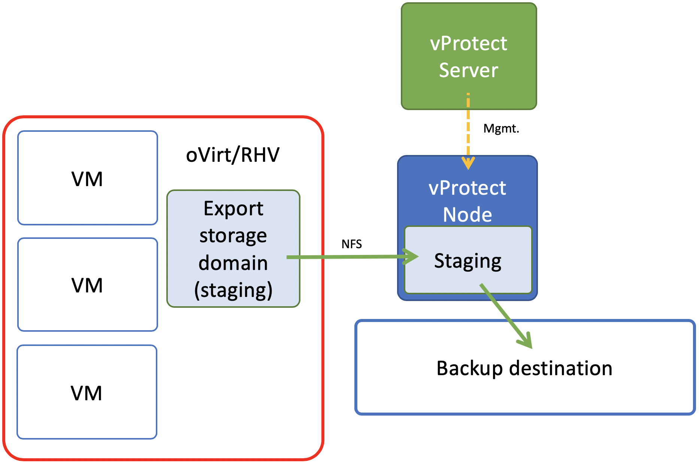
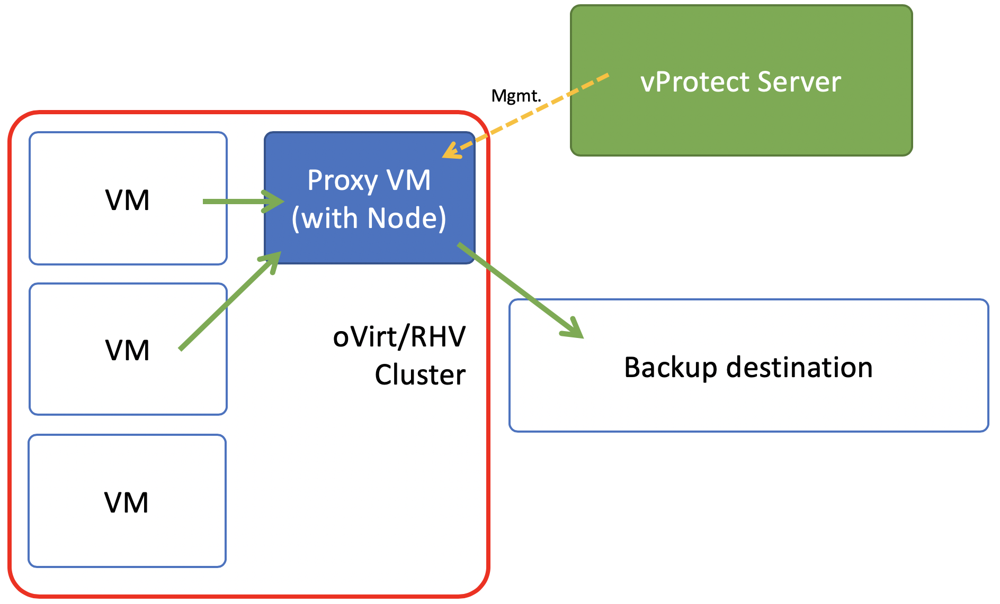
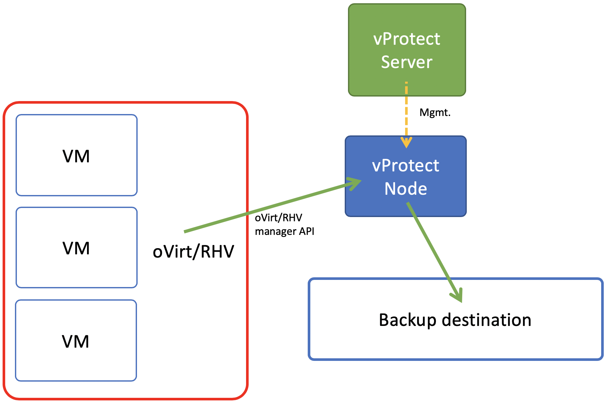

# Deployment in oVirt/RHV environment

oVirt/RHV environments can be protected in several ways. Notice, that different strategies require node to be installed either as a VM on the environment that you backup or it can be installed separately.

**Backup Server** in this case is **vProtect Server. Data mover** is **vProtect Node.** In some cases, as you'll notice, vProtect Node needs to be installed inside **Proxy VM**.

### Backup strategy 1 – export storage domain \(over API v3\)

This setup requires you to create storage domain used for VM export. Export storage domain should accessible also by vProtect Node in its staging directory. This implies that storage space doesn't have to be exported by vProtect Node - it can be mounted from external source. The only requirement is to have it visible from both RHV/oVirt host and Node itself. Keep in mind that ownership of the files on the share should allow both vProtect and RHV/oVirt to read and write files. Please refer to [RHV/oVirt setup](../initial_config/virtualization-platforms/setup_rhv.md) for details.

Backup process requires that once the snapshot is created it will be cloned and exported \(in fact to the vProtect Node staging\).The reason for additional cloning is that oVirt/RHV doesn’t allow you to export snapshot directly. Node can be outside of the environment that you backup.

In general, this strategy is going to be deprecated, as Red Hat may no longer support it in the future releases.

### Backup strategy 2 – disk attachment with Proxy VM

In this strategy you have a VM – let’s call it “Proxy VM” that asks your manager to snapshot and attach drives of a specific VM to itself \(Proxy VM\). Now your proxy VM is able to read the data from the VM that you want to backup.

This strategy allows you to exclude drives from backup which you don’t need. Remember that, you need to install 1 Proxy VM per cluster, so that your backup solution it is able to attach drives.

Drawback - no incremental backup for now, but it is most common scenario.

### Backup strategy 3 – disk image transfer API

This API appeared in oVirt/RHV 4.2 and allowed export of individual snapshots directly from the RHV manager. So now, instead of having to install multiple Proxy VMs, you can have single external Node installation, which just invokes APIs via RHV manager.

This strategy supports incremental backups. Assuming you have oVirt/RHV 4.2 or newer – just add your manager to vProtect and setup is done. From network perspective - it requires two additional ports to opened 54322 and 54323 and your data be pulled from hypervisor manager.

Unfortunately, there are few problems with current architecture of this solution. The biggest issue is that all traffic passes via oVirt/RHV manager, wich may impact transfer rates that you can achieve during the backup process. To put that into perspective – in disk attachment you can basically read data as if it is local drive, where it could potentially be deduplicated even before transferring it to the backup destination.

### 

