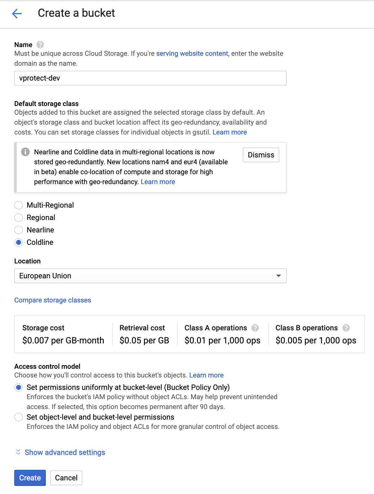
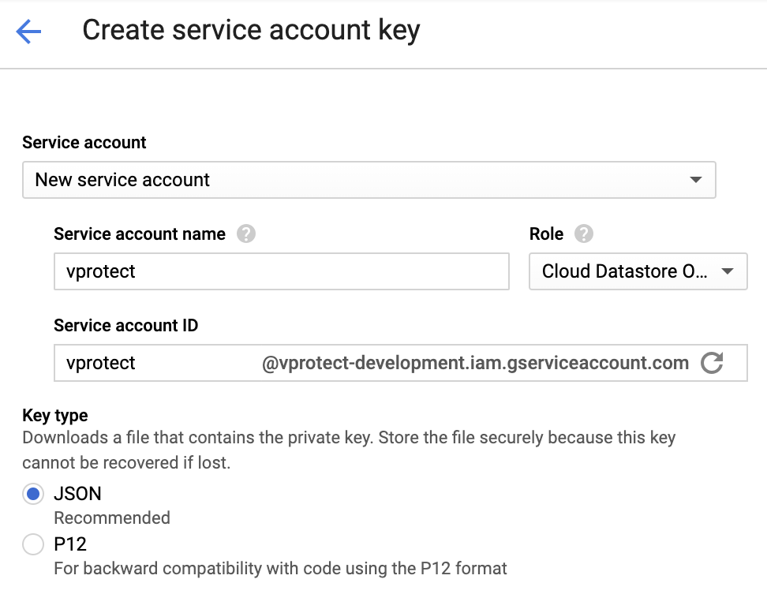
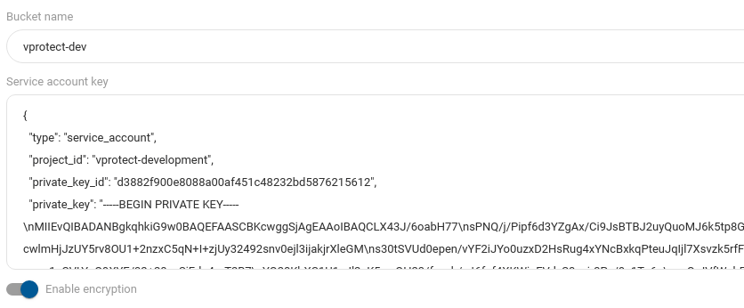

# Google Cloud Storage

**Google Cloud Storage** allows for storing and accessing data on Google Cloud Platform infrastructure. It combines the performance and scalability of Google's cloud with advanced security and sharing capabilities.

## How to use **GCS** as backup destination for **vProtect**:

1. Create a project: Click [here](https://console.cloud.google.com/cloud-resource-manager?_ga=2.160574525.-1623012609.1549010866) for more info about **Creating and Managing Projects**.
2. Create a bucket: Click [here](https://cloud.google.com/storage/docs/creating-buckets) for more info about **Creating Storage Buckets**.

   

3. Enable versioning in your bucket: Click [here](https://github.com/Storware/vprotect-manual/tree/e7b7039b975e5a518e099f05a9079b281ece5f7c/initial_config/backup-providers/[https:/cloud.google.com/storage/docs/using-object-versioning/README.md#enable]) for more info about **Enabling Object Versioning**.
4. Generate service account key: Click [here](https://cloud.google.com/iam/docs/creating-managing-service-account-keys) for more info about **Creating service account keys**. Service account key should have **Role** set to **Storage Object Admin**, while **Key type** should be set to JSON.

   

5. After the key is created, open your vProtect server page \(you can also use **CLI**\), click on **BACKUP DESTINATIONS**, press **Create Backup Destination** button, then select **Google Cloud Storage** from the drop-down list. In addition to [standard properties](https://storware.gitbook.io/storware-vprotect/admin_webui_overview/admin_webui_bd) you need to specify: 1. **Bucket name** specified during bucket creation \(your buckets can be found [here](https://console.cloud.google.com/storage/)\) 2. **Service account key** - paste content of service account key .json file created before.

