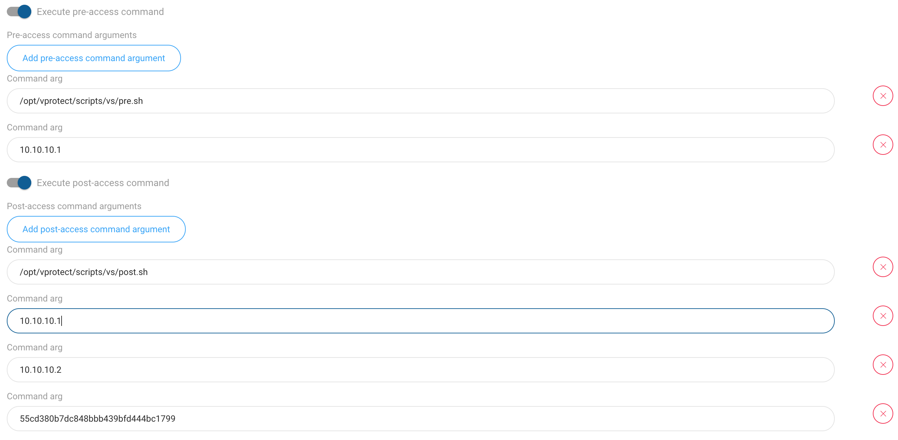

# Catalogic vStor Server setup

vProtect supports Catalogic vStor Server and integrates with it with extended File System Backup Destination logic.

You can use Catalogic volumes as any other file system \(mount single volume over NFS\) or you can use provided scripts to automatically create and replicate volumes whenever vStor volume is being accessed. This documentation describes setup with 2 vStor servers and 1-volume-per-VM approach \(with optional replication\).

1. vProtect accesses vStor Servers using SSH public key authentication - first generate key:

   ```text
   [root@vProtectbuild ~]# sudo -u vprotect ssh-keygen
   Generating public/private rsa key pair.
   Enter file in which to save the key (/opt/vprotect/.ssh/id_rsa):  
   Created directory '/opt/vprotect/.ssh'.
   Enter passphrase (empty for no passphrase): 
   Enter same passphrase again: 
   Your identification has been saved in /opt/vprotect/.ssh/id_rsa.
   Your public key has been saved in /opt/vprotect/.ssh/id_rsa.pub.
   The key fingerprint is:
   SHA256:xeceRtL4kq3zzQrUQH/K5SbiT/nv9QvAtBEfOxeT5us vprotect@vProtectbuild.lab.local
   The key's randomart image is:
   +---[RSA 2048]----+
   |          .. . o.|
   |         o +o ooo|
   |          *o=+=. |
   |         .o%o=o. |
   |        S =+@ o .|
   |         o *.= . |
   |          = +.. .|
   |           * +.Eo|
   |            +.++=|
   +----[SHA256]-----+
   ```

2. Add VM fingerprint to SSH known\_hosts on the **node** for primary \(and optionally secondary\) vStor Server:

   * it must be `known_hosts` file that belongs to `vprotect` user
   * algorithm must be set to `ssh-rsa`

   ```text
   sudo -u vprotect ssh -o HostKeyAlgorithms=ssh-rsa root@VSTOR_HOST
   ```

   **Example:**

   ```text
   [root@vProtectbuild ~]# sudo -u vprotect ssh -o HostKeyAlgorithms=ssh-rsa root@10.10.10.1
   The authenticity of host '10.10.10.1 (10.10.10.1)' can't be established.
   RSA key fingerprint is SHA256:65M/6jNBXJTFqti/798STSFeZigRzHMivDNl0t95FNI.
   RSA key fingerprint is MD5:cc:91:7d:17:8e:21:68:19:4b:c9:e4:76:bd:f5:4d:fc.
   Are you sure you want to continue connecting (yes/no)? yes
   Warning: Permanently added '10.10.10.1' (RSA) to the list of known hosts.
   ```

3. Copy key to each vStor Server:

   ```text
   [root@vProtectbuild ~]# sudo -u vprotect ssh-copy-id root@10.10.10.1
   /bin/ssh-copy-id: INFO: Source of key(s) to be installed: "/opt/vprotect/.ssh/id_rsa.pub"
   /bin/ssh-copy-id: INFO: attempting to log in with the new key(s), to filter out any that are already installed
   /bin/ssh-copy-id: INFO: 1 key(s) remain to be installed -- if you are prompted now it is to install the new keys
   root@10.10.10.1's password: 
   _
   Number of key(s) added: 1
   _
   Now try logging into the machine, with:   "ssh 'root@10.10.10.1'"
   and check to make sure that only the key(s) you wanted were added.
   ```

4. Open "BACKUP DESTINATIONS" section from the left menu: 
5. Create new Catalogic vStor Server Backup Destination \(choose from the right-top drop-down menu\)
6. Fill in template with your information: 
   * `FIRST_VS_HOST` - your primary vStor Server IP/hostname
   * `SECOND_VS_HOST` - optional, secondary vStor Server IP/hostname, where data is going to be replicated to
   * `VS_PARTNER_ID` - optional, secondary vStor partner ID - you can get this ID by running this command on vStor Server shell:

     ```text
     [root@localhost ~]# vstor partner show
     ID                               | MGMT ADDRESS | API PORT | SSH PORT
     55cd380b7dc848bbb439bfd444bc1799 | 10.10.10.2   | 8900     | 22
     ```

   * if secondary server is not provided - vProtect will assume that no replication is needed
   * **Example**:

     
7. Initiate backup to test it the scripts have been executed correctly - in the `vprotect_daemon.log` files you should be able to see messages like this:

   ```text
   2018-05-04 15:31:39.133  INFO
   [0f2b9705-61a1-44d5-876f-ac81985c4a94] Executing pre/post store command...
   ```

