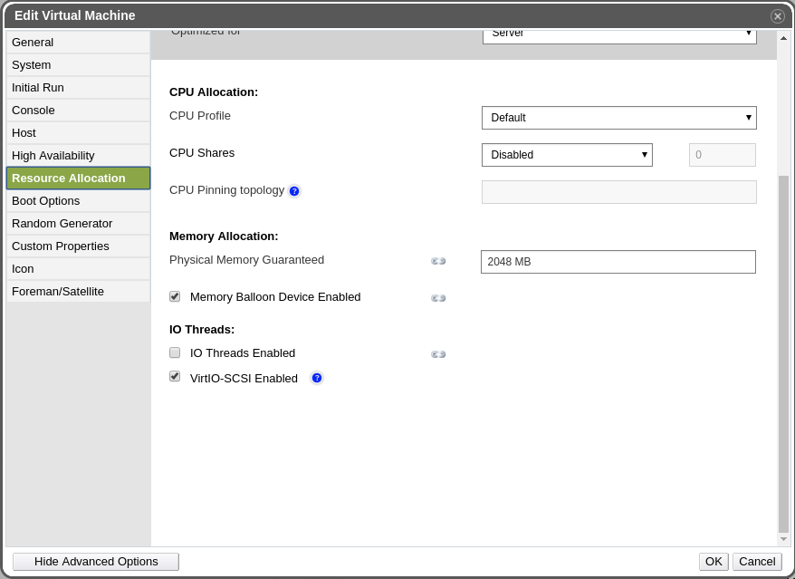

# RHV/oVirt setup

## RHV/oVirt \(API v4\)

For RHV/oVirt 4+ enviornments you can use API v4 for invoking all backup related tasks.

Import/export mode defines the way the backups and restores are done. Red Hat Virtualization \(with API v4\) supports 2 modes:

1. **Disk attachment**, which exports VM metadata \(in OVF format\) with separate disk files \(in RAW format\) via Proxy VM with the Node installed.
   * supports RHV/oVirt 4.0+
   * no incremental backup
   * proxy VM required in each cluster - used for disks attachment process
2. **Disk image transfer**, which exports VM metadata \(in OVF format\) with disk snapshot chains as separate files \(QCOW2 format\):
   * supports RHV 4.2+/oVirt 4.2.3+
   * supports incremental backup
   * disk images are transferred directly from API \(no Proxy VM required\)

When adding oVirt/RHV 4.0+ HV managers make sure to have URL like the following:

```text
https://RHV_MGR_HOST/ovirt-engine/api
```

**Notice:** username for RHV/oVirt environments needs to be provided in **user@domain** format - i.e. **admin@internal**. This user is expected to have all permissions related to manage snapshots, create/remove VMs, operate disks and export data.

### Disk attachment mode

**Note**: RHV/oVirt API v4 environments require vProtect Node to be installed in one of the VMs residing on the RHV/oVirt cluster. vProtect should detect automatically the VM with vProtect during index operation.

Disk attachment mode requires `Virtio-SCSI` to be enabled on the vProtect Node VM:



During the backup/restore operations, disks are transferred by attaching them to the proxy VM. This approach does not require export storage domain to be set up.

Please make sure to follow these steps: [LVM setup on vProtect Node for disk attachment backup mode](../setup_lvm.md)

### Disk Image Transfer \(snapshot-chains\) mode - RHV/oVirt 4.2+

Disk image transfer mode exports data directly using RHV/oVirt 4.2+ API. There is no need to setup export storage domain or setup LVM. This mode uses snapshot-chains provided by new RHV/oVirt.

You may need to open communication for additional port **54323** on the RHV/oVirt manager - it needs to be accessible from vProtect Node. Also make sure that your **ovirt-imageio-proxy** services are running and properly configured \(you can verify it by trying to upload images with oVirt UI\).

Please make sure to follow steps in this section: [Full versions of libvirt/qemu packages installation](../../install/install_libvirt_qemu.md)

### SSH Transfer

this method assumes that all data transfers are directly from hypervisor - over SSH. This means that after adding RHV/oVirt manager and detecting all available hypervisors - **you need also to provide SSH credentials or SSH keys for each of the hypervisors**. You can also use [SSH public key authentication](../../install/ssh-public-key-authentication.md).

Restore process is done via RHV/oVirt manager - like in Disk Image Transfer mode - which means that you also need to open port **54323** and make sure that your **ovirt-imageio-proxy** services are running and properly configured \(you can verify it by trying to upload images with oVirt UI\).

## RHV/oVirt \(API v3\)

RHV/oVirt 3.5.1+ environments \(using API v3\) require export storage domain to be set up.

1. Add backup storage domain in the RHEV/oVirt \(which points to the NFS export on vProtect Node\)
   * If you have multiple DC you need to enable `Multi DC export` checkbox in node configuration
     * Remember that you need to use named datacenters in your RHV/oVirt enviornment to avoid name conflicts
     * RHV/oVirt DC may use only one export storage domain, that is why you need to create subdirectories for each data center in export path i.e. `/vprotect_data/dc01`, `/vprotect_data/dc02`, and use each subdirectory as NFS share for each data center export domain \(separate NFS exports\).
     * Export \(staging\) path in above-mentioned scenario is still `/vprotect_data`, while `dc01` and `dc02` are datacenter names
     * Older versions of oVirt/RHV \(3.5.x\) require to specify mapping between DC names and export storage domains - you need to provide pairs of DC name and corresponding SD name in node configuration \(section `Hypervisor`\)
   * If you have only one DC and don't want to use multiple DC export feature in the future, you can use default settings, and setup NFS export pointing to the staging path \(e.g. `/vprotect_data`\)
   * Note that export must be set to use UID and GID of `vprotect` user
   * Example export configuration in `/etc/exports` to the selected hypervisor in RHV cluster:

     ```text
     /vprotect_data    10.50.1.101(fsid=6,rw,sync,insecure,all_squash,anonuid=993,anongid=990)
     ```

     where `anonuid=993` and `anongid=990` should have correct UID and GID returned by command:

     ```text
     [root@vProtect3 ~]# id vprotect
     uid=993(vprotect) gid=990(vprotect) groups=990(vprotect)
     ```
2. Both import and export operations will be done using this NFS share – restore will be done directly to this storage domain, so you can easily import backup into RHEV/oVirt \(shown below\)
   * backups must be restored to the export path \(node automatically changes names to the original paths that are recognized by RHV/oVirt manager.


1. When adding oVirt/RHV 4.0+ HV managers make sure to have URL like the following:

   ```text
   https://RHV_MGR_HOST/ovirt-engine/api/v3
   ```

